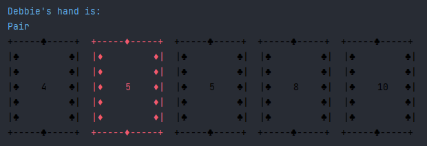

# Poker Game Kata 
## Created in Java using a Test Driven Development (TDD) Approach

This application takes two player names, deals them a random 5-card hand from the desk and then displays these cards.  Finally, showing the winner and their combination. 

## How to use this application
Run this program from the main method within the main class.

**Step 1** - Command line prompt appears to welcome players and asks for each player name.  
<em>Assumptions</em> - names can be any length but not numbers.

**Step 2** - The cards are dealt at random from the deck (so players will not have any of the same cards).  

**Step 3** - The cards within the hands are printed to the command line. See below (we see the players name, along with their combination.  In this case it is a pair.  Cards are displayed with their suits, showing Hearts and Diamonds in red and Shapes and Clubs in black. 

**Step 4** - The winner of the game is then displayed with their winning combination.  

ACE is defined as HIGH however will also be considered LOW when scoring a straight or a straight flush.
## Testing
**This application was created using a Test-Driven Development (TDD) approach.**
The test classes are split by hand combination and allow for comparison of hands. 

## Future Considerations

This application can be expanded to do the following:
* have 3+ players
* an improved User Interface
* ability to swap cards at the beginning
* bets and rounds
